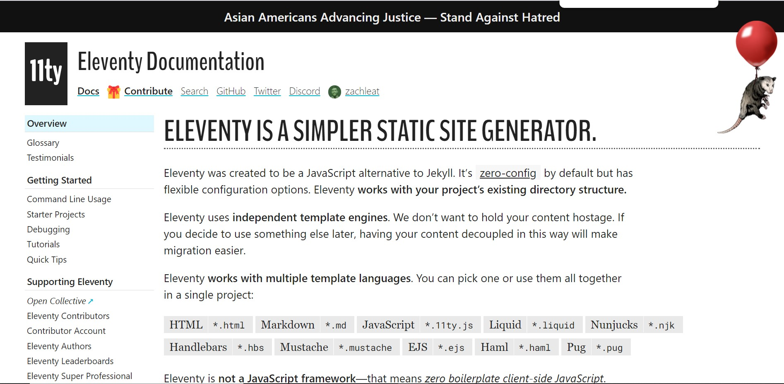
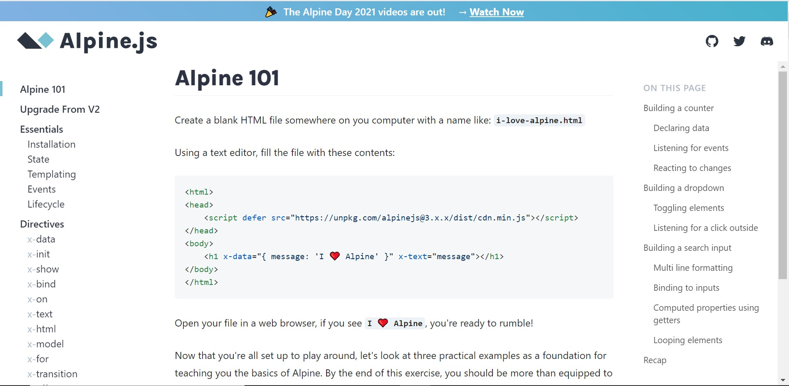

# Eleventy-11ty-with-Alpine.js

## Eleventy ( or 11ty )
Eleventy was created to be a JavaScript alternative to Jekyll. It’s zero-config by default but has flexible configuration options. It works with your project’s existing directory structure along with independent template engines. It dosen’t want to hold your content hostage. If you decide to use something else later, having your content decoupled via eleventy can make migrations easier. It also works with multiple template languages.

You can refer to the 11ty documentation for more information : [here](https://www.11ty.dev/docs/)

## Alpine.js
Alpine is a rugged, minimal tool for composing behavior directly in your markup. Think of it like jQuery for the modern web. Plop in a script tag and get going. It is a collection of 14 attributes, 6 properties, and 2 methods.

You can refer to the AlpineJS documentation for more information : [here](https://alpinejs.dev/alpine-101)
